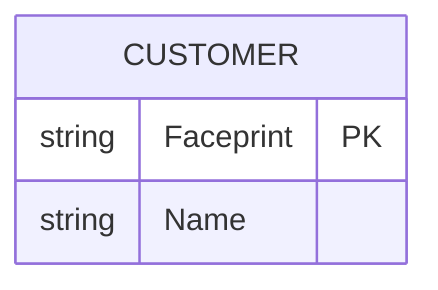
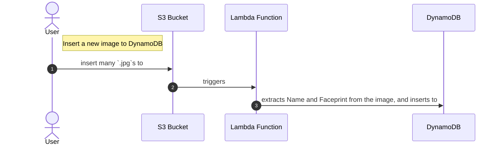
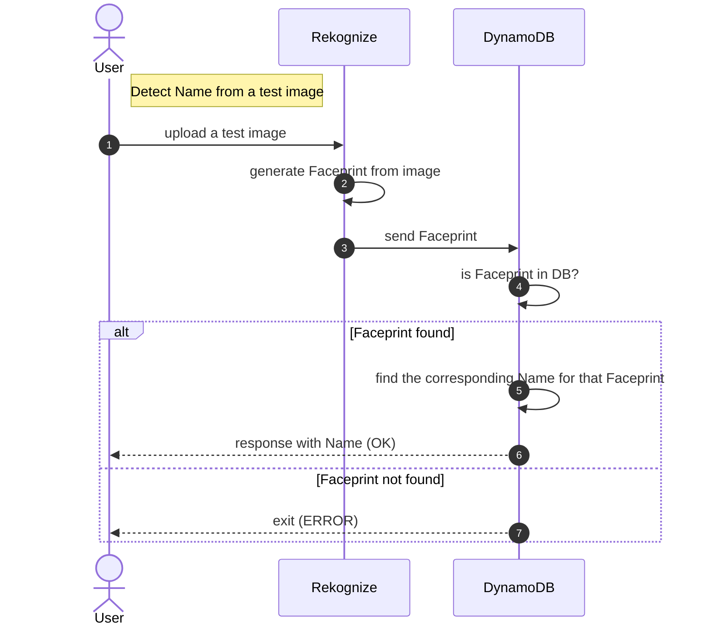

# Commands

Video Link: [https://youtu.be/oHSesteFK5c](https://youtu.be/oHSesteFK5c)


- Install aws-shell
```
pip install aws-shell
```

- Configure
```
aws configure
```

- Create a collection on aws rekognition
```
aws rekognition create-collection --collection-id facerecognition_collection --region us-east-1
```

- Create table on DynamoDB
```
aws dynamodb create-table --table-name facerecognition \
--attribute-definitions AttributeName=RekognitionId,AttributeType=S \
--key-schema AttributeName=RekognitionId,KeyType=HASH \
--provisioned-throughput ReadCapacityUnits=1,WriteCapacityUnits=1 \
--region us-east-1
```

- Create S3 bucket
```
aws s3 mb s3://bucket-name --region us-east-1
```

## FAQ

### Q: What is Amazon DynamoDB?

Amazon DynamoDB is a database located at Amazon AWS.
We define it to contain a list of Customers that have two properties:
- {string} `Faceprint` as a primary-key.
- {string} `Name`.



### Q: What is a "Faceprint"?

A `Faceprint`, also known as `faceID`, is some-kind of a string key, that is
generated as a response of analysing a specific image that was posted to
Amazon Rekognition (See [graph](https://github.com/taljacob2/amazon-rekognition-example/tree/feat-update-readme#insert-a-new-image-to-dynamodb)).
On the other way, we can also send an already-generated `Faceprint` to
Amazon Rekognition and it would respond us with the most accurate `Faceprint`
it detects that had been already stored on the DynamoDB (See [graph](https://github.com/taljacob2/amazon-rekognition-example/tree/feat-update-readme#detect-name-from-a-test-image)).

---

## Logic Explanation

### Insert A New Image To DynamoDB



### Detect Name From A Test Image


